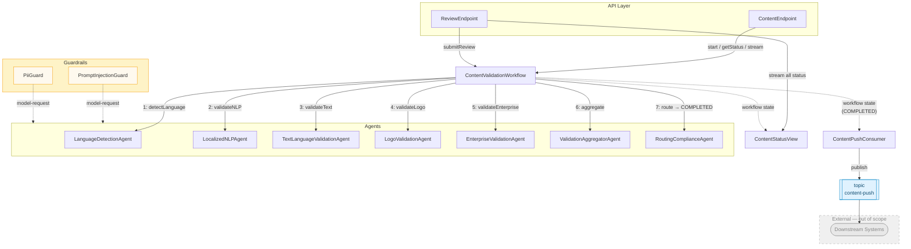
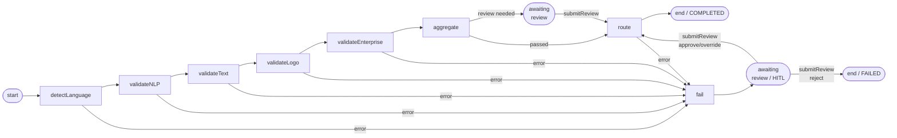

# Akka SDK Design

Akka SDK component architecture for the [Content Validation Service](SPEC.md).

---

## Component Mapping

| Spec Component                      | Akka Type       | Class                        | Package                 |
|-------------------------------------|-----------------|------------------------------|-------------------------|
| Content API | `HttpEndpoint` | `ContentEndpoint` | `api` |
| Review API | `HttpEndpoint` | `ReviewEndpoint` | `api` |
| Orchestrator Workflow | `Workflow` | `ContentValidationWorkflow` | `application` |
| Language Detection Agent | `Agent` | `LanguageDetectionAgent` | `application.agents` |
| Localized NLP / Call Reason Agent | `Agent` | `LocalizedNLPAgent` | `application.agents` |
| Text & Language Validation Agent | `Agent` | `TextLanguageValidationAgent` | `application.agents` |
| Logo Validation Agent | `Agent` | `LogoValidationAgent` | `application.agents` |
| Enterprise Validation Agent | `Agent` | `EnterpriseValidationAgent` | `application.agents` |
| Validation Results Aggregator Agent | `Agent` | `ValidationAggregatorAgent` | `application.agents` |
| Routing & Compliance Agent | `Agent` | `RoutingComplianceAgent` | `application.agents` |
| Content Push Consumer | `Consumer` | `ContentPushConsumer` | `application` |
| Content Status View | `View` | `ContentStatusView` | `application` |
| PII Guardrail | `TextGuardrail` | `PiiGuard` | `application.guardrail` |

---

## Package Structure

```
com.example.contentvalidation/
  api/
    ContentEndpoint
    ReviewEndpoint
  application/
    ContentValidationWorkflow
    ContentPushConsumer
    ContentStatusView
    agents/
      LanguageDetectionAgent
      LocalizedNLPAgent
      TextLanguageValidationAgent
      LogoValidationAgent
      EnterpriseValidationAgent
      ValidationAggregatorAgent
      RoutingComplianceAgent
    guardrail/
      PiiGuard
  domain/
    ValidationResult
    AggregatedResult
    ReviewDecision
```

---

## Component Dependencies



---

## Workflow Steps



| Step                 | Sets Status             | Publishes Notification  | Calls                          | Timeout |
|----------------------|-------------------------|-------------------------|--------------------------------|---------|
| `detectLanguage`     | `DETECTING`             | `NLP`                   | `LanguageDetectionAgent`       | 60s     |
| `validateNLP`        | `NLP`                   | `VALIDATING_TEXT`       | `LocalizedNLPAgent`            | 60s     |
| `validateText`       | `VALIDATING_TEXT`       | `VALIDATING_LOGO`       | `TextLanguageValidationAgent`  | 60s     |
| `validateLogo`       | `VALIDATING_LOGO`       | `VALIDATING_ENTERPRISE` | `LogoValidationAgent`          | 60s     |
| `validateEnterprise` | `VALIDATING_ENTERPRISE` | `AGGREGATING`           | `EnterpriseValidationAgent`    | 60s     |
| `aggregate`          | `AGGREGATING`           | `AWAITING_REVIEW` / `ROUTING` | `ValidationAggregatorAgent` | 60s  |
| `route`              | `COMPLETED`             | `COMPLETED`             | `RoutingComplianceAgent`       | 60s     |
| `fail`               | `AWAITING_REVIEW`       | `FAILED`                | —                              | —       |

Recovery: `maxRetries(2)` → `failStep` on all steps. `failStep` pauses for HITL; approve/override resumes at `route`, reject ends with `FAILED`.

---

## Agent Roles & Guardrails

Agents are grouped by `@AgentRole`. Guardrails are scoped to roles via config.

| Agent                          | Role          | Guardrails Applied      |
|--------------------------------|---------------|-------------------------|
| `LanguageDetectionAgent`       | `validator`   | Prompt Injection, PII   |
| `LocalizedNLPAgent`            | `validator`   | Prompt Injection, PII   |
| `TextLanguageValidationAgent`  | `validator`   | Prompt Injection, PII   |
| `LogoValidationAgent`          | `validator`   | Prompt Injection, PII   |
| `EnterpriseValidationAgent`    | `validator`   | Prompt Injection, PII   |
| `ValidationAggregatorAgent`    | `aggregator`  | Prompt Injection, PII   |
| `RoutingComplianceAgent`       | `router`      | Prompt Injection, PII   |

Guardrails apply to `model-request` for all roles (`agent-roles = ["*"]`), hard-blocking (`report-only = false`).

---

## Session Strategy

All agents invoked by the workflow share the same session ID: `workflowId`. This gives the model a shared conversation context across the full pipeline for a single content item.

---

## Notification Strategy

`ContentValidationWorkflow` injects a `NotificationPublisher<String>` and publishes the next status name at the end of each step. Clients subscribe per content item via `GET /content/{contentId}/stream` (SSE), which calls `notificationStream(ContentValidationWorkflow::statusUpdates).source()` on the `ComponentClient`.

This provides real-time push progress tracking without polling, complementing the pull-based `GET /content/{contentId}/status` endpoint.

---

## Testing Strategy

| Component                      | Test Class                          | Test Type   | Approach                                                                              |
|--------------------------------|-------------------------------------|-------------|---------------------------------------------------------------------------------------|
| `ContentEndpoint`              | `ContentApiIntegrationTest`         | Integration | `httpClient` for POST/GET; `componentClient` for view; `OutgoingMessages` for topic   |
| `ReviewEndpoint`               | `ContentApiIntegrationTest`         | Integration | `httpClient` for POST decision; view assertions for `AWAITING_REVIEW` → `COMPLETED`   |
| `ContentValidationWorkflow`    | `ContentValidationWorkflowIntegrationTest` | Integration | `componentClient` for workflow; view assertions; `OutgoingMessages` for topic   |
| `ContentPushConsumer`          | `ContentValidationWorkflowIntegrationTest` | Integration | `OutgoingMessages("content-push")` asserts `PushRequest` on `COMPLETED`         |
| `ContentStatusView`            | `ContentValidationWorkflowIntegrationTest` | Integration | `Awaitility` + `componentClient.forView()` asserts status, aggregation, review  |
| Validation Agents              | —                                   | Unit        | `TestKitSupport` + `TestModelProvider` (mock LLM)                                    |