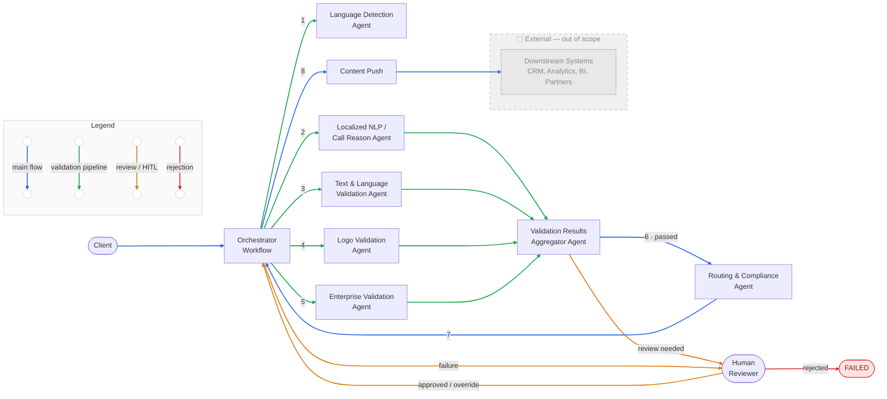
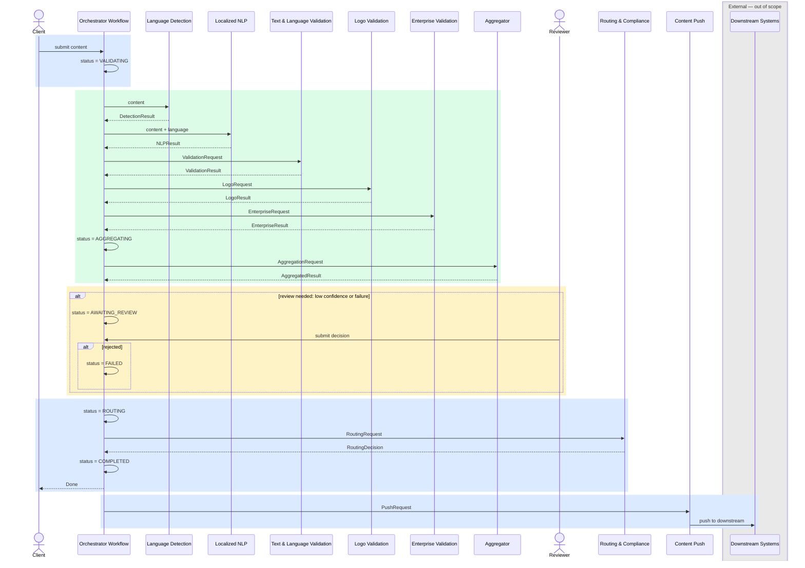
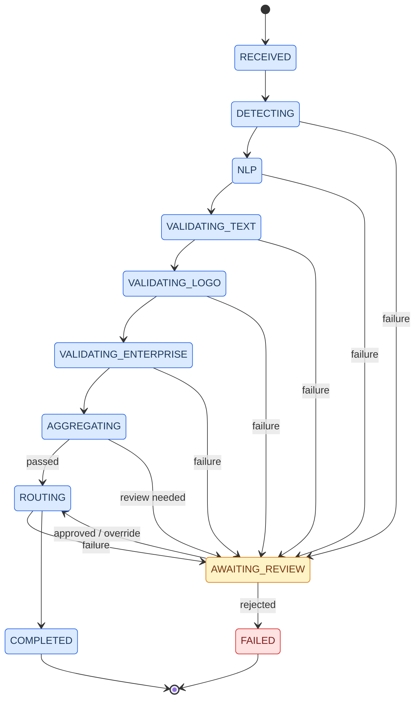

# Content Validation Service

A multi-agent pipeline for validating content through parallel AI agents before routing to downstream systems.

## Architecture



---

## Sequence Diagram



---

## Content API

Accepts inbound content submissions, exposes status polling, and streams real-time status notifications per content item. Delegates to the Orchestrator Workflow.

```yaml
openapi: 3.0.3
info:
  title: Content API
  version: 1.0.0
paths:
  /content:
    post:
      summary: Submit content for validation
      requestBody:
        required: true
        content:
          application/json:
            schema:
              type: object
              required: [contentId, payload]
              properties:
                contentId:
                  type: string
                payload:
                  type: string
                metadata:
                  type: object
                  additionalProperties:
                    type: string
      responses:
        '201':
          description: Accepted, workflow started
          headers:
            Location:
              description: URL to poll status
              schema:
                type: string
                example: /content/{contentId}/status
          content:
            application/json:
              schema:
                type: object
                properties:
                  contentId:
                    type: string
                  status:
                    type: string
                    example: RECEIVED

  /content/{contentId}/status:
    get:
      summary: Poll validation status
      parameters:
        - name: contentId
          in: path
          required: true
          schema:
            type: string
      responses:
        '200':
          description: Current workflow status
          content:
            application/json:
              schema:
                type: object
                properties:
                  contentId:
                    type: string
                  status:
                    type: string
                    enum: [RECEIVED, DETECTING, NLP, VALIDATING_TEXT, VALIDATING_LOGO, VALIDATING_ENTERPRISE, AGGREGATING, AWAITING_REVIEW, ROUTING, COMPLETED, FAILED]
                  routingTarget:
                    type: string

  /content/{contentId}/stream:
    get:
      summary: Stream real-time status notifications (SSE)
      description: >
        Server-Sent Events stream backed by the workflow NotificationPublisher.
        Emits the new status name on each step transition until the workflow ends.
      parameters:
        - name: contentId
          in: path
          required: true
          schema:
            type: string
      responses:
        '200':
          description: SSE stream of status strings
          content:
            text/event-stream:
              schema:
                type: string
                enum: [NLP, VALIDATING_TEXT, VALIDATING_LOGO, VALIDATING_ENTERPRISE, AGGREGATING, AWAITING_REVIEW, ROUTING, COMPLETED, FAILED]
```

---

## Review API

Exposes the human review decision endpoint and status streams for reviewer dashboards. Delegates to the Orchestrator Workflow and `ContentStatusView`.

```yaml
openapi: 3.0.3
info:
  title: Review API
  version: 1.0.0
paths:
  /reviews/{contentId}/decision:
    post:
      summary: Submit a human review decision
      parameters:
        - name: contentId
          in: path
          required: true
          schema:
            type: string
      requestBody:
        required: true
        content:
          application/json:
            schema:
              type: object
              required: [decision, reviewer]
              properties:
                decision:
                  type: string
                  enum: [APPROVE, REJECT, OVERRIDE]
                reviewer:
                  type: string
                notes:
                  type: string
      responses:
        '200':
          description: Decision recorded, workflow resumed

  /reviews/status/stream:
    get:
      summary: Stream all content status updates (SSE)
      description: >
        Server-Sent Events stream of all workflow state changes from ContentStatusView.
        Useful for general monitoring dashboards.
      responses:
        '200':
          description: SSE stream of StatusEntry objects
          content:
            text/event-stream:
              schema:
                $ref: '#/components/schemas/StatusEntry'

  /reviews/pending/stream:
    get:
      summary: Stream content items awaiting human review (SSE)
      description: >
        Server-Sent Events stream filtered to status = AWAITING_REVIEW.
        Emits existing pending items on connect, then pushes new ones as they arrive.
        Intended for reviewer inbox dashboards.
      responses:
        '200':
          description: SSE stream of StatusEntry objects in AWAITING_REVIEW
          content:
            text/event-stream:
              schema:
                $ref: '#/components/schemas/StatusEntry'

components:
  schemas:
    StatusEntry:
      type: object
      properties:
        contentId:
          type: string
        payload:
          type: string
        language:
          type: string
        results:
          type: array
          items:
            type: object
            properties:
              agentId:
                type: string
              passed:
                type: boolean
              issues:
                type: array
                items:
                  type: string
        aggregatedResult:
          type: object
          properties:
            overallPassed:
              type: boolean
            confidence:
              type: number
            summary:
              type: string
        reviewDecision:
          type: object
          properties:
            decision:
              type: string
            reviewer:
              type: string
            notes:
              type: string
        status:
          type: string
          enum: [RECEIVED, DETECTING, NLP, VALIDATING_TEXT, VALIDATING_LOGO, VALIDATING_ENTERPRISE, AGGREGATING, AWAITING_REVIEW, ROUTING, COMPLETED, FAILED]
        routingTarget:
          type: string
```

---

## Orchestrator Workflow

Sequentially validates content through agents, aggregates results, optionally pauses for human review (triggered by low confidence or failure), then routes. On completion, a Consumer asynchronously publishes to the `content-push` topic.

### Status Lifecycle



### State

```json
{
  "contentId": "string",
  "payload": "string",
  "language": "string",
  "results": [{ "agentId": "string", "passed": "boolean", "issues": ["string"] }],
  "aggregatedResult": { "overallPassed": "boolean", "confidence": "number", "summary": "string" },
  "reviewDecision": { "decision": "APPROVE | REJECT | OVERRIDE", "reviewer": "string", "notes": "string" },
  "status": "RECEIVED | DETECTING | NLP | VALIDATING_TEXT | VALIDATING_LOGO | VALIDATING_ENTERPRISE | AGGREGATING | AWAITING_REVIEW | ROUTING | COMPLETED | FAILED",
  "routingTarget": "string"
}
```

---

## Human Review (HITL)

When the workflow cannot proceed automatically it pauses at `AWAITING_REVIEW` and waits for a human decision submitted via the Review API.

**Trigger conditions**

| Trigger | Condition |
|---|---|
| Low confidence | Aggregator returns `overallPassed == false` or `confidence < 0.8` |
| Step failure | Any validation step exhausts retries |

**Outcomes**

| Decision | Result |
|---|---|
| `APPROVE` | Workflow resumes at routing |
| `OVERRIDE` | Workflow resumes at routing, bypassing failed checks |
| `REJECT` | Workflow ends with `FAILED` |

---

## Guardrails

Two input guardrails applied to all agents before each model request.

| Guardrail | Category | Scope | Aborts |
|---|---|---|---|
| Prompt Injection | `PROMPT_INJECTION` | all agents, model-request | yes |
| PII | `PII` | all agents, model-request | yes |

- **Prompt Injection** — similarity-based detection against known injection examples; threshold 0.75
- **PII** — custom rule-based check; blocks content containing personal identifiers before reaching the LLM

---

## Language Detection Agent

> *"Detect the language of the provided text. Return the ISO 639-1 language code and a confidence score between 0 and 1."*

```json
{ "input": { "content": "string" },
  "output": { "language": "string", "confidence": "number" } }
```

---

## Localized NLP / Call Reason Agent

> *"Classify the call reason from the content and validate it meets localization requirements for the detected language. Return the call reason category and whether it passed."*

```json
{ "input": { "content": "string", "language": "string" },
  "output": { "callReason": "string", "passed": "boolean", "issues": ["string"] } }
```

---

## Text & Language Validation Agent

> *"Validate the text for grammar correctness and language policy compliance. Return whether it passed and a list of issues found."*

```json
{ "input": { "content": "string", "language": "string" },
  "output": { "agentId": "string", "passed": "boolean", "issues": ["string"] } }
```

---

## Logo Validation Agent

> *"Check whether required logos are present and compliant with brand guidelines. Return pass/fail and any findings."*

```json
{ "input": { "contentId": "string", "contentUrl": "string" },
  "output": { "passed": "boolean", "findings": ["string"] } }
```

---

## Enterprise Validation Agent

> *"Apply enterprise business rules to the content. Return whether all rules passed and list any violations."*

```json
{ "input": { "content": "string", "metadata": { "key": "value" } },
  "output": { "passed": "boolean", "violations": ["string"] } }
```

---

## Validation Results Aggregator Agent

> *"Given a list of validation results from multiple agents, produce a consolidated report. Return overall pass/fail, a confidence score, and a brief summary of failures if any."*

```json
{ "input": { "contentId": "string", "results": [{ "agentId": "string", "passed": "boolean", "issues": ["string"] }] },
  "output": { "overallPassed": "boolean", "confidence": "number", "summary": "string" } }
```

---

## Routing & Compliance Agent

> *"Determine the routing destination for the content based on its validation outcome and apply final compliance checks. Return the target platform and compliance status."*

```json
{ "input": { "contentId": "string", "aggregatedResult": {}, "reviewDecision": {} },
  "output": { "target": "string", "compliant": "boolean", "reason": "string" } }
```
