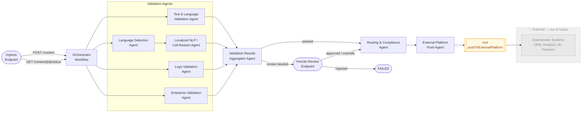
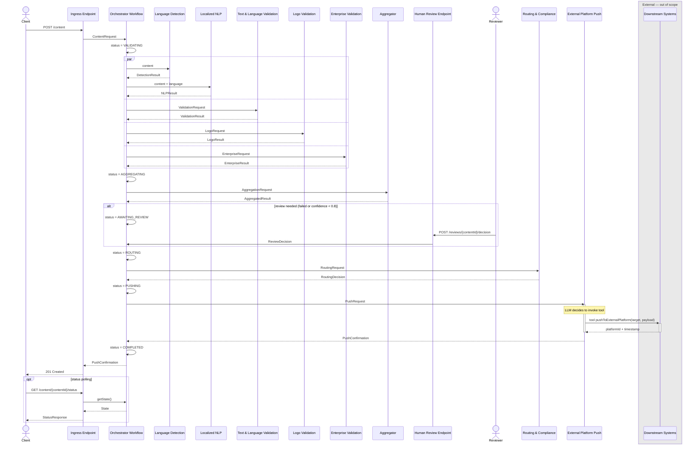
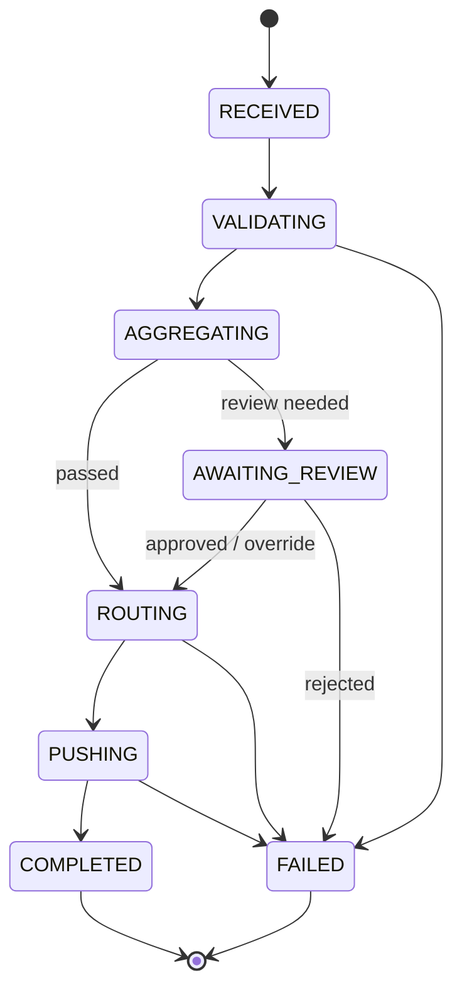

# Content Validation Service

An Akka-based multi-agent pipeline for validating content through parallel AI agents before routing to downstream systems.

## Architecture



---

## Sequence Diagram



---

## Ingress Endpoint

**Akka type:** `HttpEndpoint`
Accepts inbound content submissions and exposes status polling. Delegates to the Orchestrator Workflow.

```yaml
openapi: 3.0.3
info:
  title: Content Validation API
  version: 1.0.0
paths:
  /content:
    post:
      summary: Submit content for validation
      requestBody:
        required: true
        content:
          application/json:
            schema:
              type: object
              required: [contentId, payload]
              properties:
                contentId:
                  type: string
                payload:
                  type: string
                metadata:
                  type: object
                  additionalProperties:
                    type: string
      responses:
        '201':
          description: Accepted, workflow started
          content:
            application/json:
              schema:
                type: object
                properties:
                  contentId:
                    type: string
                  status:
                    type: string
                    example: RECEIVED

  /content/{contentId}/status:
    get:
      summary: Poll validation status
      parameters:
        - name: contentId
          in: path
          required: true
          schema:
            type: string
      responses:
        '200':
          description: Current workflow status
          content:
            application/json:
              schema:
                type: object
                properties:
                  contentId:
                    type: string
                  status:
                    type: string
                    enum: [RECEIVED, VALIDATING, AGGREGATING, AWAITING_REVIEW, ROUTING, PUSHING, COMPLETED, FAILED]
                  routingTarget:
                    type: string
```

---

## Orchestrator Workflow

**Akka type:** `Workflow`
Statically orchestrates the fixed validation pipeline: fan-out to agents, aggregate, optional human review, route, push.

### Status Lifecycle



### Data Model

```java
record State(
    String contentId,
    String payload,
    String language,                   // set after language detection
    List<ValidationResult> results,    // collected from all agents
    AggregatedResult aggregatedResult, // set after aggregation
    ReviewDecision reviewDecision,     // set if HITL step occurred
    Status status,
    String routingTarget
) {}

enum Status { RECEIVED, VALIDATING, AGGREGATING, AWAITING_REVIEW, ROUTING, PUSHING, COMPLETED, FAILED }
```

---

## Human Review (HITL)

**Akka type:** `HttpEndpoint`
The workflow pauses at `AWAITING_REVIEW` and exposes an endpoint for a human reviewer to submit a decision. The workflow resumes on receipt.

```yaml
paths:
  /reviews/{contentId}/decision:
    post:
      summary: Submit a human review decision
      parameters:
        - name: contentId
          in: path
          required: true
          schema:
            type: string
      requestBody:
        required: true
        content:
          application/json:
            schema:
              type: object
              required: [decision, reviewer]
              properties:
                decision:
                  type: string
                  enum: [APPROVE, REJECT, OVERRIDE]
                reviewer:
                  type: string
                notes:
                  type: string
      responses:
        '200':
          description: Decision recorded, workflow resumed
```

Trigger condition (set by Aggregator): `overallPassed == false || confidence < 0.8`

---

## Language Detection Agent

> *"Detect the language of the provided text. Return the ISO 639-1 language code and a confidence score between 0 and 1."*

```java
record DetectionResult(String language, double confidence) {}
```

---

## Text & Language Validation Agent

> *"Validate the text for grammar correctness and language policy compliance. Return whether it passed and a list of issues found."*

```java
record ValidationRequest(String content, String language) {}
record ValidationResult(String agentId, boolean passed, List<String> issues) {}
```

---

## Localized NLP / Call Reason Agent

> *"Classify the call reason from the content and validate it meets localization requirements for the detected language. Return the call reason category and whether it passed."*

```java
record NLPRequest(String content, String language) {}
record NLPResult(String callReason, boolean passed, List<String> issues) {}
```

---

## Logo Validation Agent

> *"Check whether required logos are present and compliant with brand guidelines. Return pass/fail and any findings."*

```java
record LogoRequest(String contentId, String contentUrl) {}
record LogoResult(boolean passed, List<String> findings) {}
```

---

## Enterprise Validation Agent

> *"Apply enterprise business rules to the content. Return whether all rules passed and list any violations."*

```java
record EnterpriseRequest(String content, Map<String, String> metadata) {}
record EnterpriseResult(boolean passed, List<String> violations) {}
```

---

## Validation Results Aggregator Agent

> *"Given a list of validation results from multiple agents, produce a consolidated report. Return overall pass/fail, a confidence score, and a brief summary of failures if any."*

```java
record AggregationRequest(String contentId, List<ValidationResult> results) {}
record AggregatedResult(boolean overallPassed, double confidence, String summary) {}
```

---

## Routing & Compliance Agent

> *"Determine the routing destination for the content based on its validation outcome and apply final compliance checks. Return the target platform and compliance status."*

```java
record RoutingRequest(String contentId, AggregatedResult result, ReviewDecision reviewDecision) {}
record RoutingDecision(String target, boolean compliant, String reason) {}
```

---

## External Platform Push Agent

> *"Push the validated content to the specified external platform using the available push tool. Return the platform-assigned confirmation ID and timestamp."*

```java
record PushRequest(String contentId, String target, String payload) {}
record PushConfirmation(String platformId, Instant pushedAt) {}

// Tool called by the LLM to perform the actual push
@FunctionTool(description = "Push content to an external platform. Returns a platform-assigned confirmation ID.")
private PushConfirmation pushToExternalPlatform(String target, String payload) {
    // HTTP call to external platform
}
```